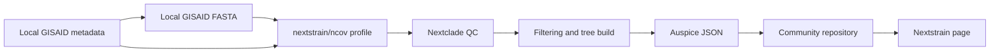

# Pakistan SARS-CoV-2 Nextstrain Build

[](https://zenodo.org/badge/latestdoi/1231056402)

This repository documents a reproducible workflow for building the Pakistan SARS-CoV-2 Nextstrain dataset served at:

- Maintained workflow repository: https://github.com/adnanhaider81/pakistan-sars-cov-2-nextstrain-build
- Nextstrain community build: https://nextstrain.org/community/NIH-BIGVI-PAKISTAN/ncov/Pakistan
- NIH-BIGVI Auspice JSON publishing repository: https://github.com/NIH-BIGVI-PAKISTAN/ncov

This repository is maintained from the `adnanhaider81` GitHub account. The generated Auspice JSON files are published to `NIH-BIGVI-PAKISTAN/ncov`, which is the repository served by Nextstrain community hosting.

The repository contains the Pakistan build profile, helper scripts, and step-by-step instructions. It does not contain GISAID sequence data or generated Auspice JSON outputs.

## Portfolio quick view

This repository shows the operational side of public pathogen-genomics communication: preparing a Pakistan-specific Nextstrain profile, running the official `nextstrain/ncov` workflow with local GISAID inputs, validating Auspice JSON outputs, and publishing the public community dataset through a separate repository.



## Public repository checklist

| Item | Status |
| --- | --- |
| README and method documentation | Present |
| Reproducible profile/scripts | `profiles/` and `scripts/` |
| Tests or smoke checks | Shell syntax and JSON/YAML parsing checks |
| Example or synthetic data | Not included because the workflow depends on restricted GISAID inputs |
| Data privacy note | Present; no GISAID FASTA, metadata, or generated full JSON outputs are committed |
| License and citation metadata | Present |
| Container recipe | Uses the official Nextstrain environment; local container wrapper planned |
| Zenodo DOI | [10.5281/zenodo.20257432](https://doi.org/10.5281/zenodo.20257432) |

## Overview

The build uses the official Nextstrain `ncov` workflow with a Pakistan-specific profile.

Input data:

- A GISAID SARS-CoV-2 metadata TSV file.
- A matching GISAID SARS-CoV-2 sequence FASTA file.
- A small open Nextstrain reference set for rooting and global phylogenetic context.

Main outputs:

- `auspice/ncov_Pakistan.json`
- `auspice/ncov_Pakistan_root-sequence.json`
- `auspice/ncov_Pakistan_tip-frequencies.json`

These three files are copied into `NIH-BIGVI-PAKISTAN/ncov` to update the public Nextstrain community build.

## Data Policy

Do not commit GISAID FASTA, metadata, or generated full Auspice JSON files to this repository.

GISAID data are subject to GISAID terms of use. Keep downloaded GISAID data local, and only share data according to the relevant database terms and institutional policies.

## Requirements

The workflow is intended for Linux or WSL.

Required command line tools:

- `git`
- `curl`
- `python3`
- `snakemake`
- `augur`
- `nextclade`
- `iqtree`
- `seqkit`
- `mafft`
- `treetime`

The helper installer can download the standalone tools that are easiest to miss:

```bash
bash scripts/install_linux_tools.sh
```

If `snakemake` and `augur` are not installed, install the Nextstrain command line environment using the official Nextstrain documentation.

## Quick Start

Clone this repository:

```bash
git clone https://github.com/adnanhaider81/pakistan-sars-cov-2-nextstrain-build.git
cd pakistan-sars-cov-2-nextstrain-build
```

Install/check local helper tools:

```bash
bash scripts/install_linux_tools.sh
```

Download and prepare the official `nextstrain/ncov` workflow:

```bash
bash scripts/setup_ncov.sh
```

Run the Pakistan build with local GISAID files:

```bash
bash scripts/run_build.sh \
  /path/to/gisaid_hcov-19_YYYY_MM_DD.tsv \
  /path/to/gisaid_hcov-19_YYYY_MM_DD.fasta
```

The build outputs will be written under:

```text
work/ncov/auspice/
```

## Publishing to Nextstrain Community

The public Nextstrain page reads static Auspice JSON files from:

```text
https://github.com/NIH-BIGVI-PAKISTAN/ncov/tree/main/auspice
```

After a successful local build, copy and commit the outputs to the community repository:

```bash
bash scripts/publish_to_community_repo.sh /path/to/local/NIH-BIGVI-PAKISTAN-ncov
```

Review the changes:

```bash
git -C /path/to/local/NIH-BIGVI-PAKISTAN-ncov status
git -C /path/to/local/NIH-BIGVI-PAKISTAN-ncov diff --stat
```

Push when ready:

```bash
bash scripts/publish_to_community_repo.sh /path/to/local/NIH-BIGVI-PAKISTAN-ncov --push
```

The updated dataset should then be available at:

```text
https://nextstrain.org/community/NIH-BIGVI-PAKISTAN/ncov/Pakistan
```

## Build Method

The build follows these stages:

1. Download GISAID metadata and FASTA for Pakistan SARS-CoV-2 sequences.
2. Prepare the `nextstrain/ncov` workflow at release `v16`.
3. Add the Pakistan build profile from `profiles/pakistan`.
4. Download a small open Nextstrain reference dataset.
5. Sanitize GISAID sequence names and metadata fields.
6. Align sequences with Nextclade.
7. Run Nextclade QC and join QC results into metadata.
8. Filter low-quality/problematic sequences.
9. Build a maximum-likelihood tree with IQ-TREE.
10. Refine the tree with TreeTime and root it on `Wuhan-Hu-1/2019`.
11. Infer mutations, clades, traits, and tip frequencies.
12. Export Auspice v2 JSON files.
13. Copy the three `ncov_Pakistan*.json` files into the community repository.
14. Commit and push the community repository to update Nextstrain.

More detail is available in [docs/build-method.md](docs/build-method.md).

## Current Build Notes

The May 6, 2026 update used:

- 5,351 Pakistan GISAID input genomes.
- 5,059 final sequences after Nextstrain/Nextclade filtering.
- 4,897 Pakistan sequences in the final tree.
- 162 non-Pakistan reference/context sequences.

The context sequences help with rooting and global clade placement. The public GitHub JSON file should remain below GitHub's 100 MB hard file-size limit.

## Repository Layout

```text
profiles/pakistan/        Pakistan-specific Nextstrain profile files
scripts/                  Setup, run, and publish helper scripts
docs/build-method.md      Detailed build explanation
```

## Citation

Please cite the archived Zenodo release when using this workflow:

Haider, S. A. (2026). Pakistan SARS-CoV-2 Nextstrain Build (v0.1.0). Zenodo. https://doi.org/10.5281/zenodo.20257432

The all-version Zenodo concept DOI is https://doi.org/10.5281/zenodo.20257431.

## Troubleshooting

If `augur filter` reports that `seqkit` is missing, run:

```bash
bash scripts/install_linux_tools.sh
```

If `augur refine` reports that the root cannot be found, check that the reference metadata includes:

```text
Wuhan-Hu-1/2019
```

If the final `ncov_Pakistan.json` is larger than 100 MB, reduce the number of sequences by changing the subsampling scheme in the generated `work/ncov/my_profiles/pakistan/builds.yaml`.

If map warnings mention missing latitudes/longitudes for Pakistan divisions, add those places to the `lat_longs.tsv` file used by the workflow.
